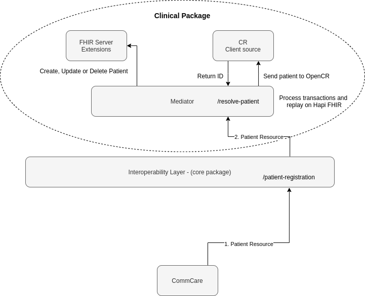

# Covid19 Immunization Tracking Package

This package sets up an [OpenHIM Mapping Mediator](https://jembi.github.io/openhim-mediator-mapping/) instance that handles the mapping of COVID-19 vaccinations into FHIR resources.

To enable this package within the Instant OpenHIE, mount this project directory with your Instant OpenHIE start command. More details available on the [Instant OpenHIE docs site](https://openhie.github.io/instant/docs/how-to/creating-packages#how-to-execute-your-new-package)

## Patient Registration/Update flow

The following diagram is a summary of the Patient registration/update workflow:



1. A patient resource will be sent into the interoperability layer (IOL) from a client application (e.g CommCare). The IOL will have a channel configured listening on `/patient-registration`.
2. The patient resource will be routed to the mapping mediator which will orchestrate the data. First, the patient will be sent to the Client Registry (CR) to check whether or not it exists. If the patient does not exist in the CR, the record will be created there and the patient resource will also be created in HAPI-FHIR.
If the patient exists, an update request will be sent to HAPI-FHIR.

> For more information on configuring the OpenHIM Mapping Mediator for an Instant OpenHIE package, please visit the Instant OpenHIE [docs site](https://openhie.github.io/instant/docs/how-to/configure-openhim-mapping-mediator).

## Example message structures

The input message will be sent through the OpenHIM.

The following channels are set up:

- GET  <http://localhost:5001/patient-search>
- POST <http://localhost:5001/patient-registration>
- PUT  <http://localhost:5001/patient-registration/{FHIR_ID}>
- POST <http://localhost:5001/immunization>

### Patient Resource

To **create** a patient, send through the following payload to `/patient-registration`

```json
{
  "resourceType": "Patient",
  "id": "Covid19PatientExample",
  "meta": {
    "profile": [
      "https://jembi.github.io/covid19-immunization-ig//StructureDefinition/covid19-patient"
    ]
  },
  "text": {
    "status": "extensions",
    "div": "<div xmlns=\"http://www.w3.org/1999/xhtml\"><p><b>Generated Narrative</b></p><p><b>Eligible For Vaccine</b>: true</p><p><b>Patient Area Type</b>: <span title=\"Codes: \">urban</span></p><p><b>identifier</b>: id: 12345</p><p><b>name</b>: John Doe </p><p><b>telecom</b>: ph: (+27) 00 123 4567(WORK)</p><p><b>gender</b>: male</p><p><b>birthDate</b>: 1981-05-21</p></div>"
  },
  "extension": [
    {
      "url": "https://jembi.github.io/covid19-immunization-ig//StructureDefinition/eligible-for-vaccine",
      "valueBoolean": true
    },
    {
      "url": "https://jembi.github.io/covid19-immunization-ig//StructureDefinition/area-type",
      "valueCodeableConcept": {
        "coding": [
          {
            "code": "urban"
          }
        ]
      }
    }
  ],
  "identifier": [
    {
      "system": "https://jembi.github.io/covid19-immunization-ig/patient-id",
      "value": "12345"
    }
  ],
  "name": [
    {
      "family": "Doe",
      "given": ["John"]
    }
  ],
  "telecom": [
    {
      "system": "phone",
      "value": "(+27) 00 123 4567",
      "use": "work"
    }
  ],
  "gender": "male",
  "birthDate": "1981-05-21"
}
```

You should receive the created form of the Patient resource in HAPI FHIR - notice the Resource now has an `id` field.

To **update** a patient, send through the payload above to `/patient-registration/{FHIR_ID}` but add the field `id` to the object root.
Also substitute in the `id` into the Request path in the `FHIR_ID` placeholder position.

### Patient Search

To **search** for a patient, send a get request to the endpoint `/patient-search`. The following query parameters can be used `_id`, `language`, `active`, `gender` and `given` for the name. Other search parameters are available [here](https://www.hl7.org/fhir/patient.html#search)

Examples

- GET  <http://localhost:5001/patient-search?_id=1233434545>
- GET  <http://localhost:5001/patient-search?given=Simon>
- GET  <http://localhost:5001/patient-search?active=true>
- GET  <http://localhost:5001/patient-search?gender=male>

### Immunization Resource

To **create** an immunization, send through the following payload to `/immunization`

```json
{
  "resourceType" : "Immunization",
  "id" : "Covid19ImmunizationExample",
  "meta" : {
    "profile" : [
      "https://jembi.github.io/covid19-immunization-ig//StructureDefinition/covid19-immunization"
    ]
  },
  "text" : {
    "status" : "extensions",
    "div" : "<div xmlns=\"http://www.w3.org/1999/xhtml\"><p><b>Generated Narrative</b></p><p><b>Last Dose</b>: false</p><p><b>Dose Given</b>: true</p><p><b>status</b>: completed</p><p><b>vaccineCode</b>: <span title=\"Codes: {http://snomed.info/sct 840534001}\">COVID-19 vaccination</span></p><p><b>patient</b>: <a href=\"Covid19Patient/example\">Covid19Patient/example</a></p><p><b>occurrence</b>: Jan 26, 2021, 10:26:54 AM</p><h3>ProtocolApplieds</h3><table class=\"grid\"><tr><td>-</td><td><b>DoseNumber[x]</b></td></tr><tr><td>*</td><td>100</td></tr></table></div>"
  },
  "extension" : [
    {
      "url" : "https://jembi.github.io/covid19-immunization-ig//StructureDefinition/last-dose",
      "valueBoolean" : false
    },
    {
      "url" : "https://jembi.github.io/covid19-immunization-ig//StructureDefinition/dose-given",
      "valueBoolean" : true
    }
  ],
  "status" : "completed",
  "vaccineCode" : {
    "coding" : [
      {
        "system" : "http://snomed.info/sct",
        "code" : "840534001",
        "display" : "COVID-19 vaccination"
      }
    ]
  },
  "patient" : {
    "reference" : "Covid19Patient/example"
  },
  "occurrenceDateTime" : "2021-01-26T10:26:54.421Z",
  "protocolApplied" : [
    {
      "doseNumberPositiveInt" : 100
    }
  ]
}
```

## Testing

To run the gherkin end to end tests for the Covid19 immunization flows follow the steps below.

For local deployment, update the `.env.local` file in the docker folder with the details for reaching the OpenHIM and run the commands below

```sh
yarn
yarn test
```

For remote deployment, update the `.env.remote` file in the kubernetes folder with the details for reaching the OpenHIM and run the commands below

```sh
yarn
yarn test:remote
```
